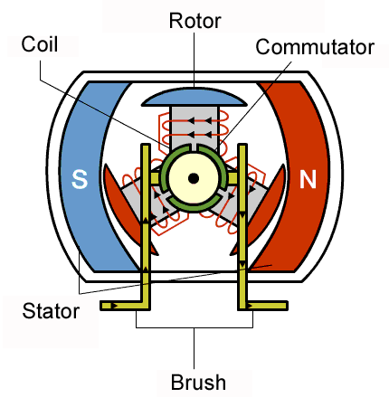
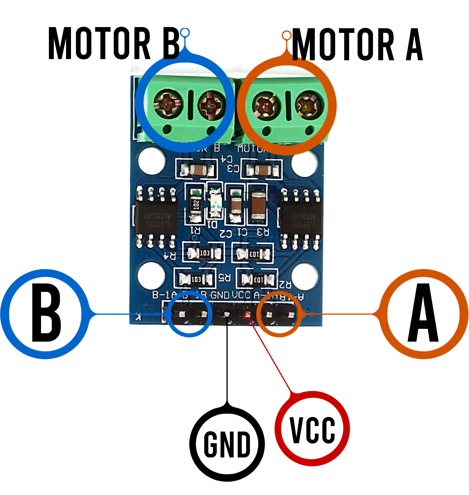
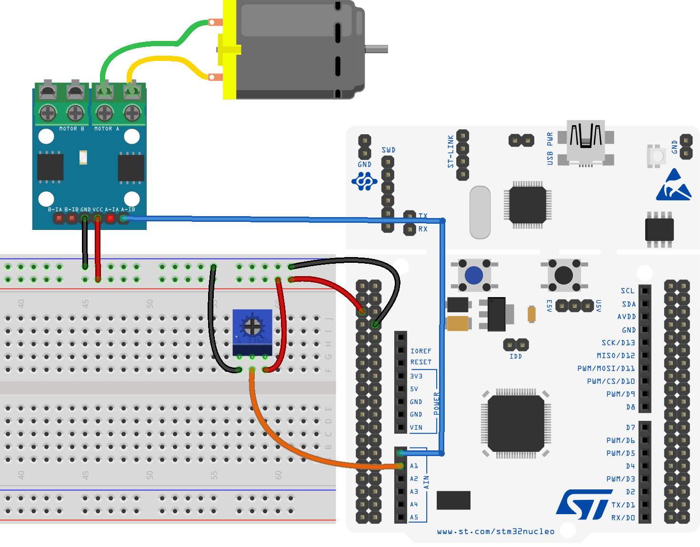
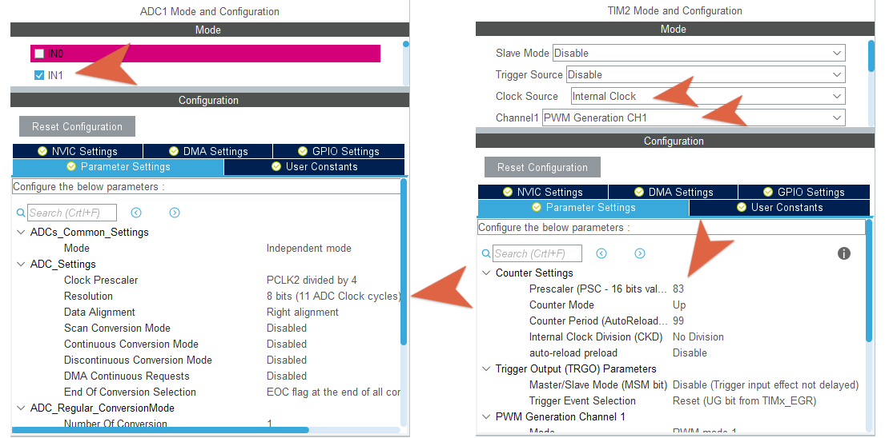
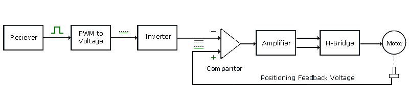
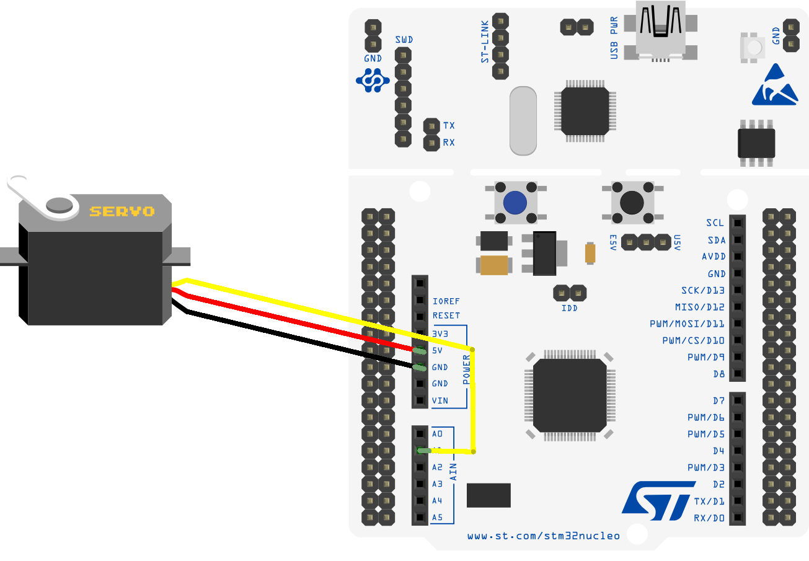
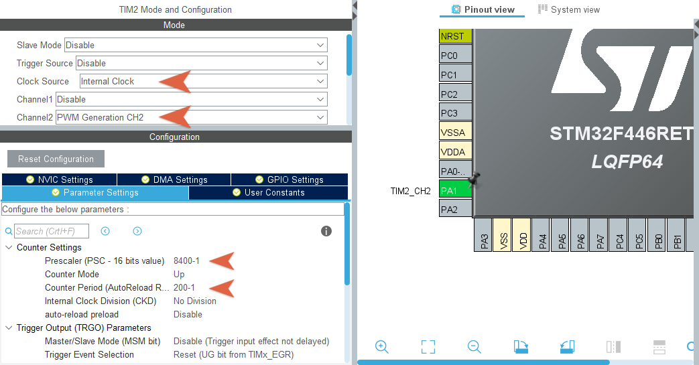

# Esercitazione 1
### Motori CC a Spazzole e ServoMotori

***
</br>

## Overview 
In questa esercitazione vengono presentati degli esempi di utilizzo di due principali motori a corrente continua: i *motori a spazzole* e i *servomotori*. Entrambi necessitano di un controllo che passa per l'utilizzo di opportuni segnali *PWM* ed entrambi sono  molto utilizzati come attuatori nel contesto di sistemi di controllo embedded.

* [Motori CC a Spazzole (*BDCM*)](#Motori-CC-a-Spazzole-(BDCM))
  * [Ponte H // L9110](#Ponte-H-//-L9110)
  * [Controllo di un motore a spazzole](#Controllo-di-un-motore-a-spazzole)
* [ServoMotori](#Servomotori)
  * [Controllo di un servomotore](#Controllo-di-un-servomotore)

</br></br>

## Motori CC a Spazzole (*BDCM*)

Sono utilizzati in tantissime applicazioni in ambito industriale, nei contesti legati al mondo dell'automotive ed anche in moltissime applicazioni relative al mondo della robotica; per non parlare degli svariati utilizzi nei dispositivi di uso quotidiano. Si tratta di attuatori che, in genere, si trovano ad un prezzo relativamente basso e sono semplici da mettere in opera anche in sistemi di controllo embedded.

Questi motori sono messi in funzione tramite due terminali a cui viene applicata una differenza di potenziale che permette di mettere in rotazione il *rotore*, che girerà ad una velocità proporzionale alla tensione applicata; il verso di rotazione dipende invece dalla polarità del voltaggio. Per maggiori dettagli ed approfondimenti riguardanti le equazioni che definiscono il funzionamento di tali *macchine elettriche* si rimanda a testi specifici.

<p style="margin-bottom:3%"></p>

Nelle applicazioni in cui è necessario effettuare il controllo di un motore CC, il parametro cui principalmente si è interessati è la velocità del motore, seguita eventualmente dalla direzione di rotazione; per semplici applicazioni è sufficiente fornire una adeguata tensione al motore che, come noto, è direttamente proporzionale alla sua velocità di rotazione. Per lo sviluppo di applicazioni più efficienti, nelle quali magari è necessario anche far variare la direzione di rotazione e si vuole avere un controllo della velocità più accurato, si fa uso di segnali *PWM* che devono arrivare al motore in maniera opportuna, tramite dei circuiti dedicati che prendono il nome di *drivers*. Ovviamente, il segnale *PWM* sarà utilizzato facendone variare il *duty-cycle* in modo da far variare il valor medio del segnale che arriva al motore.

Nella loro forma base, questi circuiti sono composti da almeno una resistore e un transistore, ma per evitare problemi di surriscaldamento e migliorare le possibilità del sistema, si fa uso in genere di un particolare *driver* che consiste di 4 transitori opportunamente connessi tra loro e con il motore stesso. Questo circuito, per via della sua schematizzazione grafica, prende il nome di *ponte H* (*H-bridge* o *full-bridge*).

<p align="center">
  
</P>

Come si intuisce dalla figura, a seconda di quali transistor sono attivi, si realizzano diversi "percorsi" per la corrente, permettendo in maniera semplificata, l'inversione di polarità della tensione ai capi del motore, posto al centro. 

Il controllo del motore passa dunque per la generazione dei segnali che controllano i transistor del *driver*, il *ponte H*.

#### Ponte H // L9110
Si prende come riferimento, a titolo di esempio, il *ponte H* [**L9110**](docs/L9110-datasheet.pdf), un integrato che realizza il *driver* in discussione e permette il controllo di motori che funzionano a diversi livelli di tensione, da 2.5V a 12V. Di seguito verrà utilizzato incapsulato all'interno di un modulo che fornisce in maniera semplificata la possibilità di connessione con motori e microcontrollore. In particolare, tale modulo permette il collegamento ed il controllo di due motori contemporaneamente: ogni motore è gestito da due pin di controllo.

<p align="center"> 
  
</p>

Generalmente, i pin hanno i nomi e la funzione per come indicato di seguito:

| Pin |Descrizione|
| :-: | :-:            |
|B-IA	|Motor B Input A |
|B-IB	|Motor B Input B |
|GND	|Ground          |
|VCC	|Voltage  2.5-12V|
|A-IA	|Motor A Input A |
|A-IB	|Motor A Input B |

La relazione tra configurazione degli ingressi del modulo e risultato in uscita, sui pin del *ponte H* è diretta. Illustrata nella seguente tabella, espressa in termini di valori logici di tensione: basso (**L**) e alto (**H**).

|Input (IA // IB) |	Output (OA // OB) | Movimento Motore|
| :-: |  :-:  | :-: |
|L // L	| L // L	|Off| 
|H // L	| H	// L	|Forward| 
|L // H	| L	// H	|Reverse| 
|H // H	| H	// H	|Off| 

#### :dart: Segnale PWM di controllo
La velocità del motore è direttamente proporzionale alla tensione applicata ai suoi capi. Lavorando con un segnale *PWM*, la tensione a cui fare riferimento sarà il valore medio del segnale, che corrisponda alla *componente continua* dello stesso. È importante quindi scegliere il segnale *PWM* in modo che la sua frequenza sia abbastanza alta ed abbia una valore maggiore della *frequenza di taglio* del sistema che descrive il motore.

La funzione di trasferimento che descrive un motore DC a spazzole, può essere in genere vista come:

<p align="center">
  
</p>

che è la funzione di trasferimento caratteristica di un sistema del primo ordine (un filtro passa basso, come ogni sistema reale) con una frequenza di taglio pari a:

<p align="center">
  
</p>

Se la frequenza del segnale *PWM* sarà al di sopra di questa, allora verrà "ignorata" dal sistema e l'unica componente che verrà tenuta in considerazione sarà la componente in continua, che corrisponde proprio al valore medio del segnale *PWM*.

Solo scegliendo un'adeguata frequenza per il segnale *PWM* sarà possibile controllare per bene il motore, senza che esso subisca degli sbalzi di accelerazione. Il parametro da conoscere è, in definitiva, la *costante di tempo del motore*, che generalmente è un parametro che si ritrova sul datasheet del motore che si sta utilizzando.

Tendenzialmente, una scelta della frequenza che rispetti la seguente diseguaglianza
<p align="center">
  
</p>

dovrebbe essere sufficiente.

### Controllo di un motore a spazzole
Un esempio di controllo di un *BDCM*, tramite *ponte H*, si può realizzare con *STM32Cube* facendo in modo di controllare la velocità del motore tramite un potenziometro: questo viene letto tramite *ADC* ed il valore in ingresso viene mappato su una scala 0-100, che corrisponderà al valore del *duty-cyle* del segnale *PWM* che comanderà uno dei due ingressi del *ponte H*.

<p align="center">
  
</p>

Per la configurazione di *ADC* e *Timer* per la generazione del segnale *PWM* si utilizza l'ambiente grafico *CubeMX*. La configurazione consiste in:

* **ADC1**
  * Ingresso: `IN1`
  * Risoluzione: `8 bit` 
  * Modalità Continua: `DISABLE`
  * Altro: *default*
* **TIM2**
  * Sorgente Clock: `Internal Clock`
  * Canale: `PWM Generation CH1`
  * Prescalare: `84-1`
  * Contatore: `100-1`
  * Altro: *default*


<p align="center">
  
</p>

È importante fare in modo che la frequenza del segnale *PWM* sia abbastanza alta, in questo caso si tiene una frequenza elevata in modo da non avere problemi con il motore utilizzato negli esempi (di cui non è nota la costante di tempo); qualora si abbia a disposizione il datasheet del motore, fare riferimento al valore della *costante di tempo meccanica* (o altra se specificato) per determinare il valore del periodo del segnale *PWM*.

In questo caso, con i parametri utilizzati, si ottiene un segnale che ha un periodo di 0.1ms, più che sufficiente per una corretto controllo del motore.
<p align="center">
  
</p>

</br>

## ServoMotori

Un *servomotore* appartiene alla famiglia degli "attuatori rotativi" e può essere controllato in maniera efficiente per muoversi con una precisa velocità o spostarsi in una configurazione angolare desiderata. Si tratta di dispositivi molto usati nel mondo della robotica (sicuramente nei bracci robotici) ed in genere nei contesti che riguardano l'automazione industriale, in cui sono importanti dei precisi controlli di posizione.

Internamente è composto da una serie di dispositivi elettro-meccanici che determinano un sistema a ciclo chiuso, questo permette al servomotore di essere, in qualche misura, già internamente controllato. Inoltre, un sistema di ruote dentate gli permette di fornire una coppia maggiore di un semplice motore a spazzole.

<p align="center">
  
</p>

Dall'esterno viene gestito tramite un segnale *PWM*, del quale, questa volta, è importante anche il periodo; finché questo segnale sarà fornito al motore, questo manterrà una precisa posizione angolare. 

In genere, per molti servomotori si utilizza un segnale *PWM* con un periodo di 20ms (50Hz) e la variazione del *duty cycle* determina la variazione dell'angolo dell'asta del motore, da 0 a 180 gradi (in genere). I valori di *duty cycle* specifici variano da motore a motore, generalmente si ha:
* *duty cycle 1ms* : 0 gradi
* *duty cycle 2ms* : 180 gradi

Ogni altro valore di duty cycle tra questi due farà ottenere, in maniera lineare, un angolo tra 0 e 180 gradi.

<p align="center">
  
</p>

### Controllo di un servomotore
Di seguito, un esempio di controllo di un servomotore della [Tower Pro, modello SG90](http://www.towerpro.com.tw/product/sg90-7): un piccolo servomotore che può ruotare l'asse di circa 180 gradi, ma non in grado di sviluppare una coppia significativa (1.80 Kg/cm). Le informazioni riguardo il segnale di comando e la connessione si trovano sul [datasheet](docs/sg90-datasheet.pdf).

<p align="center">
  
</p>

Per scrivere un programma che gestisca la rotazione del servomotore è importante tenere in mente la relazione per cui:

`DutyCycle = (MAX – MIN) * GRADI_DESIDERATI / 180 + MIN`

in cui `MAX` è 2ms e `MIN` 1ms;

In base a questo, sarà possibile mappare un valore desiderato in gradi in un valore in *ms* da assegnare come *duty cycle* del segnale *PWM*, che comunque dovrà avere un periodo di 50Hz.

La configurazione del *timer* per la generazione del segnale *PWM* si fa tenendo in considerazione la formula 

<p align="center">
    
</p>

e, fissato il *clock* di sistema a 84MHz, si scelgono:
* `Prescalar` : 8400
* `Counter` : 200

per ottenere un segnale *PWM* di periodo 50Hz (20ms)


<p align="center">
  
</p>

Con questa configurazione, il valore del *duty cycle* (che sarà configurato nella variabile `Pulse` della struttura `sConfigOC` oppure nel registro `CCR2`) dovrà variare circa tra 10 e 20 per risultare effettivamente tra 1ms e 2ms. Sarà necessario comunque effettuare delle prove empiriche per determinare qual'è l'angolo che riesce a spaziare il motore e quali sono i valori minimi e massimi, che spesso non corrispondono totalmente a quanto riportato sui datasheet.

Un primo test si può effettuare con un `main` molto semplice, che cambi l'angolo del servomotore ogni secondo:

```c
...
HAL_TIM_PWM_Start(&htim2, TIM_CHANNEL_2);

/* Infinite loop */
while (1){
  for(int i = 10; i < 20; i+=1){
    HAL_Delay(1000);
    htim2.Instance->CCR2 = i;
  }
}
```
Si noti che per cambiare il valore del *duty cycle* si agisce direttamente sul valore contenuto nel registro `CCR2`.

Per lo sviluppo di un software più interessante, si implementa una piccola libreria che fornisce le funzioni di base per gestire il servomotore, mappando l'angolo desiderato in valori di *duty cycle* opportuni.

#### :blue_book: servo.h // servo.c

Il file header `servo.h` esporta i principali elementi utili per gestire il motore servo:
```c
/* Constants */
// MIN pulse width = 1*Counter/20 if 1ms if MIN for the motor
#define SERVO_MIN_MS	10
// MAX pulse width = 2*Counter/20 if 2ms if MAX for the motor
#define SERVO_MAX_MS	20

/* Structure for SERVO Motor */
typedef struct {
    TIM_HandleTypeDef* PWM_timer_handler;
} SERVO_t;

/* Functions */
void SERVO_init(SERVO_t* servo_struct, TIM_HandleTypeDef* PWM_timer);

void SERVO_set_degree(SERVO_t* servo_struct, float degree);

void SERVO_set_ms(SERVO_t* servo_struct, float pulse_width);
```
che trovano implementazione nel file `servo.c`.

Si definisce una struttura che conserva, per ora, solo il puntatore all'istanza del *timer* utilizzato per il segnale *PWM*.

Per il metodo di imposizione di un angolo desiderato, si fa riferimento alla formula già riportata e, per il settaggio dei valori in termini di millisecondi si delinea un semplice sistema con saturazione: in modo che il servo non ecceda mai i valori `SERVO_MIN_MS` e `SERVO_MAX_MS`, specificati manualmente nel file header in base alle prove empiriche effettuate sul motore e in base al valore del `Counter` del *timer* che genera il *PWM*.
```c
/*
 * Set degree for SERVO
 * 		pulse_width = (MAX – MIN) * degree/180 + MIN
 */
void SERVO_set_degree(SERVO_t* servo_struct, float degree){
	float pulse_width = (SERVO_MAX_MS - SERVO_MIN_MS)*degree/180 + SERVO_MIN_MS;
	SERVO_set_ms(servo_struct, pulse_width);
}

/*
 * Set millisecond for SERVO
 * 		pulse_wdith must be between MIN and MAX
 */
void SERVO_set_ms(SERVO_t* servo_struct, float pulse_width){
	if(pulse_width < SERVO_MIN_MS){
		pulse_width = SERVO_MIN_MS;
	}else if(pulse_width > SERVO_MAX_MS){
		pulse_width = SERVO_MAX_MS;
	}
	TIM_HandleTypeDef* htim = servo_struct->PWM_timer_handler;
	htim->Instance->CCR2 = pulse_width;
}
```

Con questa semplice libreria base, si può scrivere un software che lavori direttamente imponendo al servomotore gli angoli che si vogliono ottenere, che in genere è ciò che viene richiesto ad un motore di questo tipo.