# Esercitazione 2
### Sensori per Sistemi di Controllo Embedded

***
</br>


## Overview 
Di seguito vengono riportati degli esempi di utilizzo di alcuni sensori che si possono utilizzare in un Sistema di Controllo Embedded.

* [Rotary Encoder](#Rotary-Encoder)
* [Sensore di Prossimità ad Ultrasuoni](#Sensore-di-Prossimità-ad-Ultrasuoni)
* [Sensore di Temperatura](#Sensore-di-Temperatura)
* [Piattaforma Inerziale (IMU)](#Piattaforma-Inerziale-(IMU))
* [Sensore di Movimento a Infrarossi](#Sensore-di-Movimento-a-Infrarossi)


</br></br>

## Rotary Encoder
Il modulo utilizzato è un **encoder rotativo digitale**: un dispositivo elettro-meccanico che trasmette, tramite dei segnali digitali, un'informazione relativa al moto di un albero. 

<p align="center">
  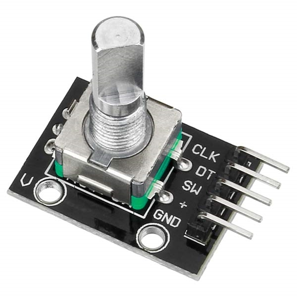
</p>

L'output digitale fornisce dunque informazioni riguardo il movimento dell'asta metallica; informazione che può essere processata per determinare, generalmente, una velocità di rotazione, una posizione, o una distanza.

Gli encoder, in diverse forme, sono utilizzati in molte applicazioni che riguardano il controllo industriale o la robotica, si trovano anche in sistemi di telecontrollo o attrezzature di laboratorio come i reometri.

Il dispositivo in analisi è un encoder rotativo incrementale che utilizza due segnali di output per determinare il movimento dell'asta metallica, questi sono detti "in quadratura" poiché sono sfasati di 90 gradi.

<p align="center">
  
</p>

In base all'analisi dei due output è possibile determinare il verso di rotazione e, contando le occorrenze dei segnali, determinare la velocità di rotazione o la posizione.

Per un dispositivo di questo tipo, molti microcontrollori ST forniscono un supporto diretto tramite i *timers*, come riportato anche sul *reference manual*:

> **TIM1 & TIM8** timer features include: 
> * Supports incremental (quadrature) encoder and Hall-sensor circuitry for positioning
purposes

In questa modalità, il *timer* viene usato come se l'encoder fosse per lui una sorgente di clock esterno; il contatore (`CNT`) varia quindi tra 0 e il valore di *auto-reload* (`ARR`), sia aumentando che decrementando, e la modalità funziona con la logica detta "X4".

Con questa modalità si può quindi ottenere un'informazione circa la posizione del sensore, dalla quale calcolare anche velocità o accelerazione, parametri utili se il sensore viene usato per operazioni che riguardano il controllo di velocità di un motore.

<p align="center">
  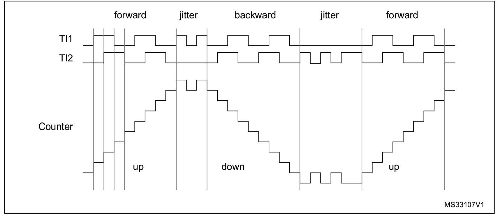
</p>

L'utilizzo di questo modulo si esegue con *STM32Cube*, passando per una prima configurazione grafica in *CubeMX*. L'encoder utilizzato compie 20 passi per eseguire una rotazione completa, vista la modalità di funzionamento dell'*encoder mode* bisogna fare scegliere il valore di `counter` in maniera adeguata. Le altre impostazioni restano a quelle di default, tranne che per `Encoder Mode`, che viene utilizzato fare in modo che il conteggio si effettui su entrambi i canali del *timer*.

<p align="center">
  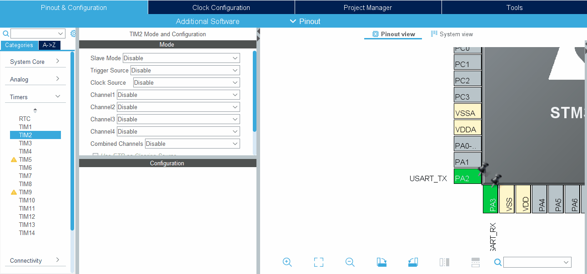
</p>

Dopo la configurazione, nel `main()`, si fa partire il timer in *modalità encoder* con *interrupt* e nel ciclo di vita principale si inviano tramite *UART* i valori dell'encoder.
```c
...
HAL_TIM_Encoder_Start_IT(&htim2, TIM_CHANNEL_1 | TIM_CHANNEL_2);
HAL_TIM_Base_Start(&htim2);

/* Infinite loop */
while (1){
  // Get Encoder Value from timer
  encoder_val = TIM2->CNT;
  sprintf(uart_data_buff, "\r%d\n", encoder_val/4);

  // UART TX
  HAL_UART_Transmit(&huart2, (uint8_t *)uart_data_buff, sizeof(uart_data_buff), HAL_MAX_DELAY);
  HAL_Delay(100);
}
```
<p align="center">
  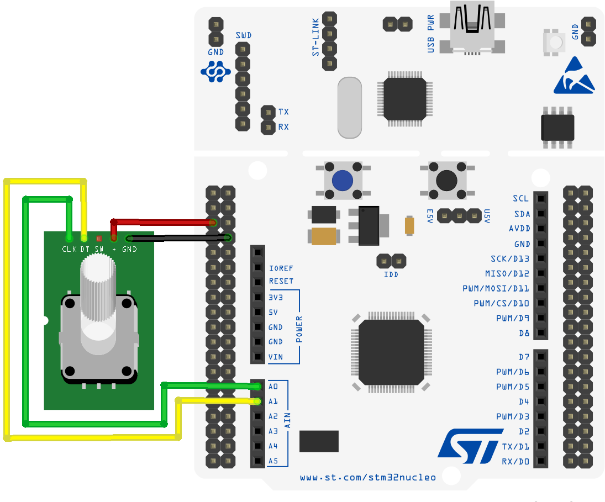
</p>

Un encoder di questo tipo è principalmente utilizzato per motivi di "selezione" in contesti di teleoperazione piuttosto che per il calcolo di una velocità di rotazione (a causa della sua bassa risoluzione), dunque essenzialmente si fa uso della sua posizione. 

In genere però, gli encoder vengono utilizzati principalmente per misure di velocità, magari del rotore di un motore. Il metodo probabilmente più semplice ed efficace consiste nel misurare la frequenza degli impulsi dell'encoder e trasformarla in una misura di velocità angolare: si contano il numero di impulsi in una fissata finestra temporale e si determina la velocità angolare come:

<p align="center">
  
</p>

in cui  è il numero di impulsi per una intera rotazione,  è il numero di impulsi osservati in una finestra temporale indicata da .

</br>

## Sensore di Prossimità ad Ultrasuoni
Sensori di questo tipo sfruttano in genere un segnale ad ultrasuoni, con una frequenza di 40 KHz, per determinare la distanza da ciò che hanno di fronte. L'onda trasmessa viene riflessa dall'ostacolo e torna indietro al sensore che, determinano il tempo di volo dell'onda e conoscendo la velocità del suono nell'aria, permette il calcolo della distanza dall'ostacolo.

Il modulo utilizzato è*HC-SR04*, che permette di determinare la distanza di un ostacolo tra 2cm e 4m, con una risoluzione che può arrivare ai 3mm. Si tratta di un modulo che contiene sia trasmettitore che ricevitore, posti sullo stesso asse.

<p align="center">
  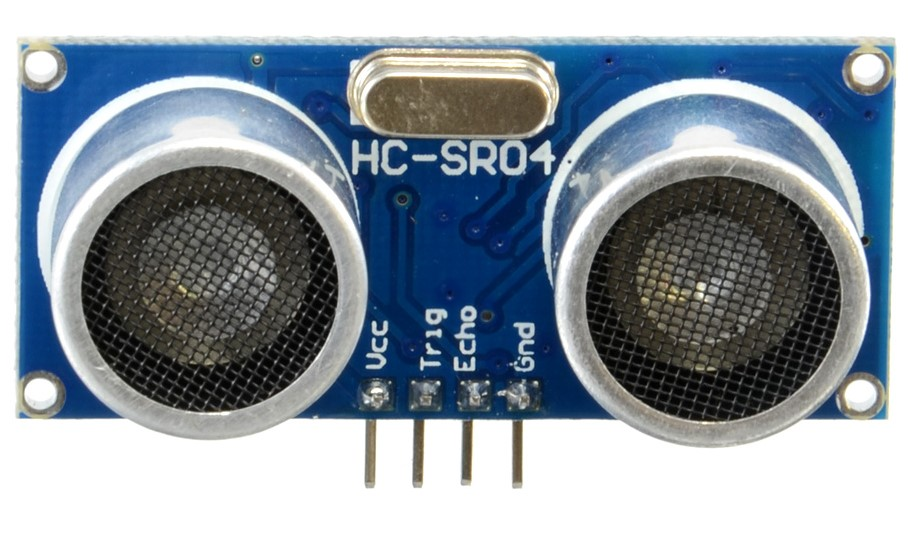
</p>

Tutte le informazioni si possono ritrovare sul [datasheet](docs/HCSR04-datasheet.pdf), da cui si estrae anche la logica particolare con cui deve essere utilizzato. I passi da eseguire per determinare la distanza sono infatti:


* Mantenere il pin `TRIG` alto per 10 μs
* Attendere gli 8 cicli di ultrasuoni a 40 KHz senza fare nulla
* Quando il segnale comincia a tornare indietro, intercettare il valore alto del pin `ECHO` e calcolare il tempo per cui questo resta alto
* Determinare la distanza usando la durata (in μs) del segnale `ECHO` alto e la velocità del suono in aria
* Attendere almeno 60ms prima di effettuare una nuova misura

<p align="center">
  
</p>

Nota la velocità del suono in aria (343.1m/s a 20° o 0.0343cm/μs) si determina la distanza percorsa dall'onda secondo una relazione che mette insieme tempo e velocità. 
Quindi da

<p align="center">
  
</p>

utilizzando la velocità del suono in aria si ricava:

<p align="center">
  
</p>

in cui **t** è il tempo di volo dell'onda in aria, che corrisponde al tempo per cui il segnale `ECHO` si mantiene alto. Bisogna però tenere presente che l'onda percorre per due volte la stessa distanza, quando emessa verso l'oggetto e dopo la riflessione verso il sensore; è necessario quindi dividere per due la distanza calcolata. In definitiva:

<p align="center">
  
</p>

<p align="center">
  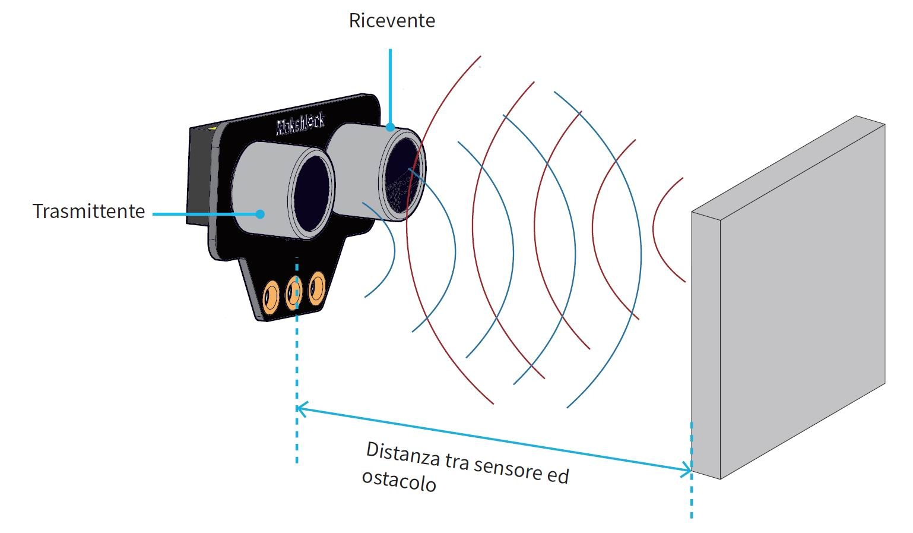
</p>


Di seguito si mostra l'esempio di utilizzo di tale sensore in un programma che, in *STM32Cube*, sfrutta i *timers* per gestire il sensore ed acquisire le misure di distanza, inviate quindi tramite *UART* ad un terminale di controllo.

<p align="center">
  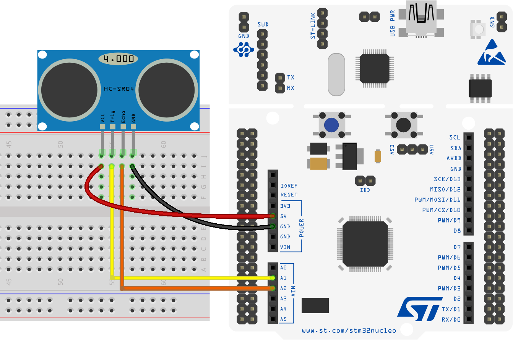
</p>

Nell'interfaccia di *CubeMX* si configura il *timer* in modo che il suo incremento permetta di tener traccia del passare del tempo in microsecondi. Fissato il clock di sistema a 84MHz si sceglie il prescalare a 84 in modo da avere un clock che varia a 1Mhz; si sceglie inoltre il valore massimo del contatore: 0xffff (65535).

<p align="center">
  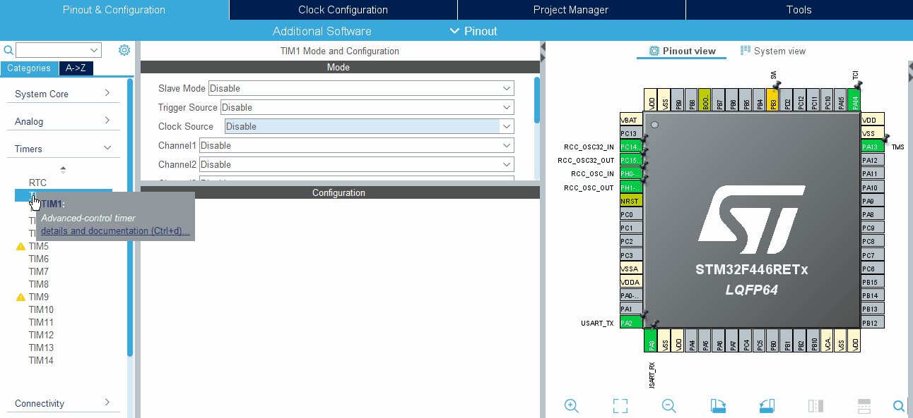
</p>

Per identificare il passare del tempo in microsecondi si implementa una funzione di *delay* specifica:

```c
void delay_us(uint32_t us){
	__HAL_TIM_SET_COUNTER(&htim1, 0);
	while ((__HAL_TIM_GET_COUNTER(&htim1)) < us);
}
```
Che porta il counter del *timer* a 0 e aspetta che il suo incremento raggiunga il valore desiderato; il timer incrementa il valore del contatore di una unità ogni microsecondo.

Sfruttando questa funzione è possibile scrivere un metodo che comandi la lettura dal sensore ad ultrasuoni:
```c
uint32_t HCSR04_read(void){
	echo_time = 0;

	// Pull TRIG pin low for at least 2 us
	HAL_GPIO_WritePin(GPIOA, GPIO_PIN_1, GPIO_PIN_RESET);
	delay_us(2);

	// Keep TRIG pin High for 10 us for start the sensor
	HAL_GPIO_WritePin(GPIOA, GPIO_PIN_1, GPIO_PIN_SET);
	delay_us(10);
	HAL_GPIO_WritePin(GPIOA, GPIO_PIN_1, GPIO_PIN_RESET);

	// Wait for the ECHO pin to go high
	while (!(HAL_GPIO_ReadPin(GPIOA, GPIO_PIN_4)));
	// Measure time for which the pin is high
	while (HAL_GPIO_ReadPin(GPIOA, GPIO_PIN_4)){
		echo_time++;
		delay_us(1);
	}
	// The delay of 1us give 1.8us (measured by scope)
	return echo_time*1.8;
}
```
Si noti che il valore effettivo del "tempo di echo" misurato deve essere moltiplicato per 1.8 in quanto la precisione del timer permette di valutare le variazioni di 1.8μs invece che 1μs. Questo risultato si evince da un'analisi sperimentale con oscilloscopio.

A partire dal valore `echo_time` si determina quindi la distanza nel ciclo di vita principale del programma.
```c
/* Infinite loop */
while (1){
  // Read from sensor
  sensor_time = HCSR04_read();
  // d = (t * 0.0343)/2
  distance  = sensor_time * (0.0343)/2;
  // UART TX
  sprintf(uart_data_buff, "\r%.5f\n", distance);
  HAL_UART_Transmit(&huart2, (uint8_t *)uart_data_buff, sizeof(uart_data_buff), HAL_MAX_DELAY);
  // Delay (at least 60ms before new read)
  HAL_Delay(100);
}
```
Nel terminale di controllo seriale è possibile visualizzare la misura ottenuta dal sensore di prossimità ponendolo di fronte ad un ostacolo a distanza variabile. Si presti attenzione a far passare almeno 60ms tra una misura e la successiva, come specificato nel datasheet.

</br>

## Sensore di Temperatura
Si prende come riferimento un sensore di temperatura della *Texas Instrument*: [LMT84](docs/lmt84.pdf). Tutte le informazioni riguardo il collegamento con la scheda e la trasformazione del segnale di tensione letto in un valore di temperatura, si possono individuare consultando il [datasheet](docs/lmt84.pdf) del sensore. 

<p align="center">
    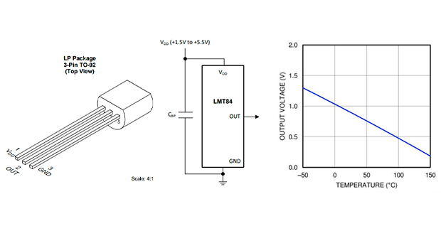
</p>

Si tratta di un sensore di temperatura analogico, con caratteristica lineare che fornisce una temperatura tra -50° e 150°. Per utilizzarlo si fa uso di un ADC che restituisce un valore in *mV*, per convertire tale valore di tensione in un valore di temperatura si utilizza una formula di trasformazione estratta a partire da quella riportata sul datasheet:

<p align="center">
    
</p>

da cui, tramite formula inversa, si ricava facilmente la temperatura **<em>T</em>**.

<p align="center">
    
</p>

:traffic_light: Esempi di utilizzo, in diverse modalità, si trovano [qui](https://github.com/p-ansatz/FPSE-Esercitazioni/tree/master/Esercitazione%206%20-%20IO%20Analogico#io-analogico-con-stm32cube).

</br>

## Piattaforma Inerziale (IMU)

Noti gli strumenti software per gestire il funzionamento del bus e del protocollo **I²C**, è possibile studiare i dettagli relativi alla piattaforma inerziale MPU-6050, una *IMU* a *6 DOF* che si trova incapsulata su un modulo pronto per la connessione **I²C**.

<p align="center">
    
</p>

Tutte le informazioni necessarie all'implementazione di un programma che realizzi una corretta comunicazione con il sensore si ricavano a seguito dello studio del [datasheet](docs/MPU-60x0-Datasheet.pdf) e della [documentazione relativa ai registri contenuti nel modulo MPU-6050](docs/MPU-60x0-Register-Map.pdf). 

In un contesto del genere è sensato implementare una *libreria* che si occupi di gestire il sensore e mediare la comunicazione **I²C**. Grazie alla libreria implementata è possibile strutturare il `main.c` in modo che vengano invocate le funzioni esportate dalla libreria stessa per la configurazione e la lettura dei dati dal sensore. Prima però è indispensabile configurare la periferica **I²C**, sfruttando l'interfaccia di configurazione di *CubeMX*.

<p align="center">
    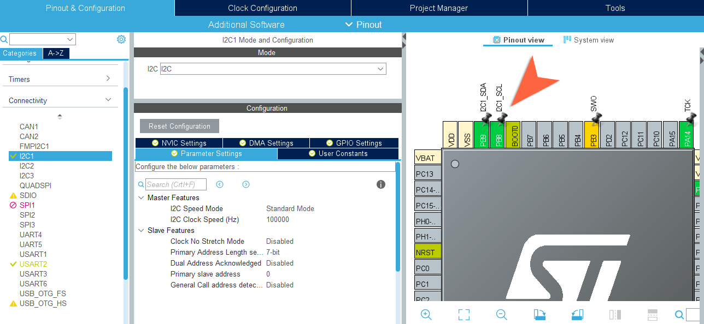
</p>

A questo punto, nel main è possibile leggere i dati proveniente dal sensore connesso tramite bus **I²C**, ovviamente a seguito di un'adeguata configurazione:
```c
/* Configure Accel and Gyro parameters */
Mpu_Config.Accel_Full_Scale = AFS_SEL_4g;
Mpu_Config.Clock_Source = INTERNAL_8MHz;
Mpu_Config.Config_Dlpf = DLPF_184A_188G_Hz;
Mpu_Config.Gyro_Full_Scale = FS_SEL_500;
Mpu_Config.Sleep_Mode_Bit = 0;  //1: sleep mode, 0: normal mode
MPU6050_Init(&hi2c1, &Mpu_Config); // Initialization - Configuration

/* Infinite loop */
while (1){
    MPU6050_Read_RawData(&Accel_Raw, &Gyro_Raw);
    MPU6050_Read_ScaledData(&Accel_Scaled, &Gyro_Scaled);

    HAL_GPIO_TogglePin(GPIOA, GPIO_PIN_5);
    HAL_Delay(1000);
}
```

:closed_book: È possibile approfondire la libreria analizzando anche un esempio [qui](MPU-6050).


</br>

## Sensore di Movimento a Infrarossi

Un sensore digitale che può essere utilizzato è il sensore passivo piroelettrico (*PIR*) **HC-SR501**. Questo sensore permette, tramite infrarossi, di rilevare il movimento di un "corpo caldo" entro 7 metri. L'uscita fornita è un segnale digitale che assume il valore alto (3V) quando viene rilevato un movimento.

Il sensore deve essere prima opportunamente regolato, in base a quanto riportato nella [documentazione](docs/HC-SR501.pdf) rilasciata dal produttore. Si noti che si tratta di un modulo già pronto che ha al suo interno diverse componenti, si può fare riferimento alle singole componenti per avere informazioni più dettagliate.

<p align="center">
  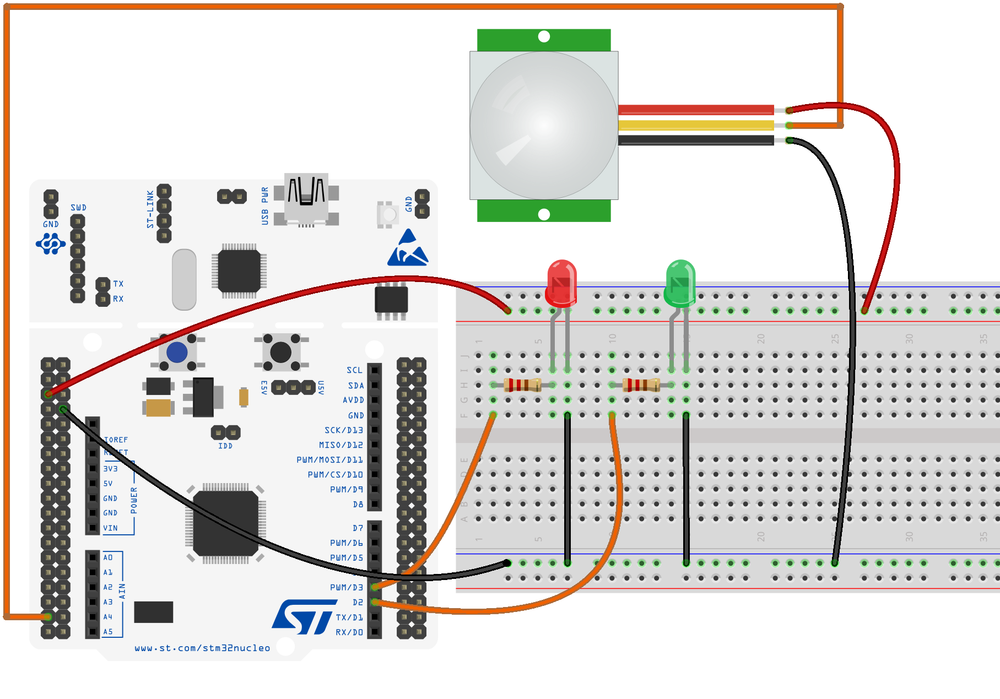
</p>

Si realizza facilmente un'applicazione per utilizzarlo, facendo uso di una **interrupt** che identifichi un fronte di salita sul segnale proveniente dal sensore.

:space_invader: Un esempio di utilizzo in ambiente *mbed* si trova [qui](https://github.com/p-ansatz/FPSE-Esercitazioni/tree/master/Esercitazione%205%20-%20IO%20Digitale%20con%20mbed#io-digitale-e-interrupt-zap-arm-mbed).