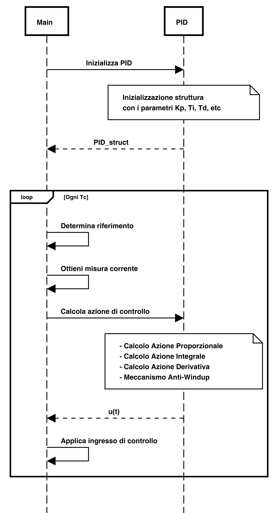

# Esercitazione 3
### Tecniche di Controllo per Sistemi Embedded

***
</br>

## Regolatore Proporzionale-Integrale-Derivativo (PID)
Nella pratica industriale e generalmente del controllo automatico, molto spesso si utilizzano dei regolatori "standard" grazie ai quali è possibile ottenere le prestazioni desiderate tramite la taratura (*tuning*) di pochi parametri. Sicuramente il **PID** appartiene a questa famiglia di controllori: di fatto è il controllore più utilizzato nell'ambito industriale.

Il **PID** è un controllore dinamico che fornisce un'azione di controllo *proporzionale* all'errore ( *e(t)* ), al suo *integrale* ed alla sua *derivata*:

<p align="center">
  
</p>

Inquadrato all'interno di un classico schema di retroazione, il **PID** si presenta in questa forma:
<p align="center">
  
</p>

o, espandendolo e mettendo in evidenza le tre componenti che lo realizzano:
<p align="center">
  
</p>


I parametri *Kp* *Ti* e *Td* sono detti rispettivamente: *guadagno proporzionale*, *costante di tempo integrale* e *costante di tempo derivativa*; variando questi tre parametri è possibile modificare le prestazione del sistema di controllo, come schematizzato nella seguente tabella.

| | Stabilità| |  |  |
|:-:|:-:|:-:| :-: | :-: |
| :arrow_up: | diminuisce |diminuisce |diminuisce |aumenta|
| :arrow_down:| diminuisce |nullo |diminuisce |aumenta|
| :arrow_up:| migliora|non influente |non influente |diminuisce|

L'effetto generale dovuto alle tre distinte componenti del regolatore si può apprezzare simulando il funzionamento del **PID** implementato con diverse strutture, ad esempio in un classico problema di *asservimento a gradino*.

<p align="center">
  
</p>

Dai risultati si evince che l'azione combinata delle tre componenti permette di risolvere in maniera efficiente il problema di controllo; l'unica componente che in maniera sensata può essere utilizzata da sola è quella proporzionale, che però necessita di un qualche termine integrale per poter azzerare l'errore di asservimento a regime. Se tale componente non è già presente nel sistema da controllare è importante introdurre l'azione integrale, che matematicamente rappresenta l'area sottesa dalla curva espressa da ) e fa sì che il controllore abbia memoria dei valori passati dell'errore.

Il termine derivativo invece permette al **PID** di avere una capacità di predizione grazie al quale è possibile ottenere uno *smoothing* della risposta del sistema controllato. Aumentando il parametro *Td* diminuisce infatti la sovraelongazione del sistema e si realizza una predizione lineare dell'errore di inseguimento, grazie alla quale è possibile "frenare" la risposta del sistema prima che si allontani troppo dal segnale di riferimento. Inoltre, grazie ad un aumento di fase del sistema in retroazione pari a 90 gradi, migliora la stabilità. Tuttavia, è importante notare che il termine derivativo tende ad amplificare i segnali ad alta frequenza e quindi anche i disturbi di misura. Queste considerazioni si ricavano dall'analisi frequenziale del regolatore e, come effetto finale, si potrebbe avere un'azione di controllo che risulta essere "nervosa". 

Inoltre, nel caso di segnali di riferimento a gradino, che presentano discontinuità di prima specie, l'azione di controllo dovuta al solo effetto derivativo sarebbe teoricamente di valore infinito ed il segnale di controllo assumerebbe quindi valori esagerati, di natura impulsiva. Ciò si traduce praticamente in un potenziale danneggiamento degli attuatori o dell'impianto.

Un'ultima considerazione riguarda la fisica realizzabilità del termine derivativo: se analizzato ci si accorge che si tratta di un sistema non causale, che richiede la conoscenza di segnali futuri. Per un'implementazione causale questo termine viene filtrato con un *filtro passa-basso* che svolge due funzioni importanti: rende il derivatore fisicamente realizzabile e compensa gli effetti del rumore di misura in alta frequenza.

La componente che riguarda solo la parte derivativa diventa dunque:

<p align="center">
  
</p>

l'introduzione del filtro appare ancora più chiara se la formulazione viene espressa nel *dominio di Laplace*:

<p align="center">
  
</p>

### Implementazione digitale di un regolatore PID

In un sistema di controllo embedded si lavora con segnali digitali ed un regolatore deve essere riformulato a tempo discreto, in modo da lavorare non con un segnale nel dominio del tempo ma con una sequenza di campioni ( ad esempio  per l'errore), conseguentemente il regolatore fornirà in input al sistema una sequenza di ingressi di controllo (  ). Ciò che deve variare, nella formulazione classica di un **PID**, sono essenzialmente la parte integrale e quella derivativa.

Il termine integrale può essere approssimato, al tempo *n*, con la somma dei rettangoli aventi base pari al periodo di campionamento  e altezza pari al valore , con . Il termine derivativo può essere approssimato al passo *n* con il rapporto incrementale tra i capioni Tc%7D) e . Si tratta dell'approssimazione più intuitiva e semplice, in realtà si può fare riferimento a tre principali metodi di discretizzazione in gergo indicati come *differenze in avanti*, *differenze all'indietro* e *metodo di Tustin* (o *trasformazione bilineare*).

<p align="center">
  
</p>

Con le approssimazioni indicate, la formulazione del **PID** che si ottiene è la seguente (sostituendo per comodità di scrittura il pedice *n* al più preciso *nTc*):

<p align="center" >
  
</p>

Sebbene implementabile e funzionale, tale equazione è computazionalmente dispendiosa a causa della sommatoria usata per approssimare l'integrale: questa necessita della memorizzazione di tutti i campioni passati dell'errore. Per limitare tale peso computazionale e la quantità di informazioni da memorizzare è possibile praticare una riformulazione dell'equazione in termini di funzione ricorsiva, definendo lo scostamento tra l'azione di controllo al passo *n* e quella al passo *n-1*.

<p align="center">
  
</p>

da cui l'azione di controllo ricorsiva:

<p align="center">
  
</p>

che, richiedendo la memorizzazione di qualche variabile in più, si mostra comunque come una formulazione sicuramente implementabile. 

È possibile ricavare un'altra formulazione ricorsiva più interessante che utilizza i termini passati dell'ingresso solo nelle parti integrale e derivativa ed inoltre implementa quest'ultima in forma filtrata, con il filtro passa-basso mostrato in precedenza. Nelle seguenti equazioni vengono mostrate in maniera separata il contributo integrale  e quello derivativo .

<p align="center">
  
</p>

### Tecniche di desaturazione dell'azione integrale
La presenza dell'effetto integrale in un **PID**, ha come effetto collaterale quello di dare luogo ad un segnale che cresce indefinitamente in ampiezza se il valore dell'errore resta costante. Dal punto di vista pratico, questo si riflette negativamente su gli attuatori dell'impianto, che presentano inevitabilmente delle limitazioni fisiche per via delle quali non è possibile fornire un'azione superiore (o inferiore) a determinati limiti fisici. Per questo motivo è bene tenere conto di effetti di *saturazione* in fase di modellazione del segnale di controllo per gli attuatori.

Quando si lavora con attuatori che presentano, per ovvi motivi, una saturazione e l'effetto integrale non viene gestito opportunamente si ha il fenomeno note come *windup dell'azione integrale*. Per evitarlo (evitando anche deterioramenti fisici del sistema) si possono adottare diverse strategie dette *anti-windup*, con le quali è possibile saturare il controllore **PID** in modo che, quando l'attuatore entra in saturazione, l'integrazione dell'errore di controllo si blocchi o addirittura decrementi. 

<p align="center">
  
</p>


Considerando un attuatore con saturazione, si può determinare questa relazione, tra ingresso di controllo e segnale processato dall'attuatore:

<p align="center">
  
</p>


Partendo da queste considerazioni è possibile strutturare il controllore, ad esempio un **PI**, con la seguente formulazione tempo continuo:

<p align="center">
  
</p>

Si noti che l'ultimo termine contribuisce con un valore pari a 0 finché l'attuatore non va in saturazione e quindi finché opera in regione lineare con %20%3D%20u(t)). Appena l'attuatore entra nel regime di saturazione si crea una discrepanza tra gli ingressi, che ha un effetto di "desaturazione dell'azione integrale" con peso determinato dal termine . 

Lo scopo di questa semplice strategia è di far diminuire il valore dell'ingresso di controllo appena si entra nei limiti di saturazione determinati dall'attuatore (informazione che comunque va ricavata da modello matematico o in maniera empirica). Ovviamente si potrebbe avere un peggioramento in termini di prestazioni, che si può arginare tarando opportunamente il parametro . 

Si noti che, un effetto simile si può ottenere anche sottraendo direttamente l'integrale dell'errore e non della discrepanza tra gli ingressi.

### Implementazione software
Partendo dalle formulazioni a tempo discreto, è possibile ricavare delle forme algoritmiche per un controllore **PID**. È importante tenere in considerazione l'intero schema di controllo nel quale si andrà ad inserire, nel contesto di un sistema di controllo embedded.

<p align="center">
  
</p>

Messo a punto l'intero sistema in termini di periferiche hardware da utilizzare, la parte di software che si occupa del **PID** si può pensare all'interno di una libreria dedicata che (in linguaggio **C**) sarà composta da un file *header* e una sua realizzazione. Le funzioni principali da esportare in questa libreria riguardano:
* L'inizializzazione del **PID** - che in maniera conveniente può essere pensato come una struttura contenente i parametri necessari al suo funzionamento;
* Il calcolo dell'azione di controllo - che grazie alla conoscenza dell'errore attuale determinerà l'azione di controllo *u(t)*;
* La gestione di un criterio di *anti-windup*;
* Il reset completo della struttura o l'aggiornamento dei suoi campi.

Il criterio che si può utilizzare nel `main` consiste nell'utilizzare un *timer* che scatta ogni *Tc* e comanda, nel ciclo di vita principale, il calcolo della legge di controllo da applicare sugli attuatori.
```c
while(1) {
  ...
  if(Tc_flag == 1) {
    r = get_reference();    // Reference Value
    y = get_measurement();  // Measurement value
    e = r - y;              // Error Value

    u = PID_calculate(e, &PID_struct); // Calculate input

    set_input(u);           // Set input to actuator

    Tc_flag = 0;
  }
}
```
La funzione `PID_calculate`, che si trova nella libreria per il controllore **PID**, si occuperà di implementare l'algoritmo di controllo in accordo ad una delle formulazioni mostrate, introducendo possibilmente un effetto *anti-windup* adeguato.

<p align="center">
  
</p>
</br></br></br>

