# Esercitazione 4
### Esempi di Progetti per Sistemi di Controllo Embedded
*** 

## Aeropendolo

Si prende in considerazione un sistema meccanico che è evoluzione del classico pendolo attuato, in cui l'attuazione è fornita da un'elica posta sull'estremità non vincolata dell'asta.

<p align="center">
  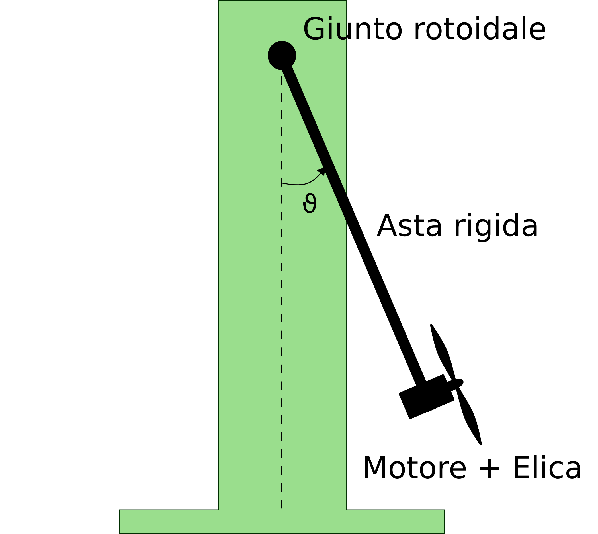
</p>

La gestione automatizzata della posizione di questo sistema, che prende il nome di *Aeropendolo*, è un interessante scopo per un sistema di controllo embedded: consiste nella realizzazione di un sistema software che permetta al pendolo di cambiare posizione in funzione di un riferimento selezionato dinamicamente. 

Nell'ottica di un sistema embedded, questo consisterà di: sistema di acquisizione dati, sistema di calcolo della legge di controllo e sistema per la gestione degli attuatori. 

Il lavoro necessario alla realizzazione di tale progetto può essere quindi suddiviso in:
* [analisi dei requisiti](#Analisi-dei-Requisiti)
* [modellazione matematica del sistema](#modellazione-matematica-del-sistema)
* [realizzazione fisica](#realizzazione-fisica)
* [progettazione della legge di controllo](#progettazione-della-legge-di-controllo)
* [implementazione software su microcontrollore](#implementazione-software-su-microcontrollore)

### Analisi dei Requisiti

Come per ogni buon progetto, la fase di *analisi dei requisiti* è una prima ed importante fase in cui definire i principali requisiti che il progetto dovrà soddisfare. Per l'aeropendolo, lo scopo è realizzare un sistema di controllo che garantisca la possibilità di variare la posizione dell'asta in un range di valori che va da 0 a 90 gradi. L'asservimento di posizione in tale range ed una adeguata reiezione ai disturbi sono intesi come requisiti *must* del progetto, cercando anche di minimizzare eventuali problemi di sovra(sotto)elonagzione o di oscillazioni del sistema.

<p align="center">
  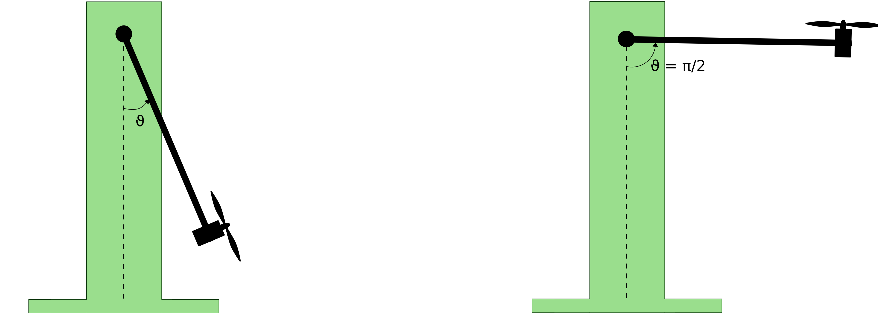
</p>

### Modellazione matematica del Sistema

La modellazione del sistema può avvenire in maniera più o meno approfondita a seconda dell'accuratezza richiesta. Una modellazione più complessa ha il vantaggio di rispecchiare più fedelmente il sistema reale a discapito di un numero di grandezze
che devono essere misurate o stimate.

Un approccio completo, prevede la modellazione separata delle singole parti che compongono il sistema (motore, elica e pendolo), estrapolando, per ciascuna di esse, delle opportune equazioni differenziali. Applicando le opportune nozioni di
fisica, è possibile individuare il seguente modello:

<p align="center">
  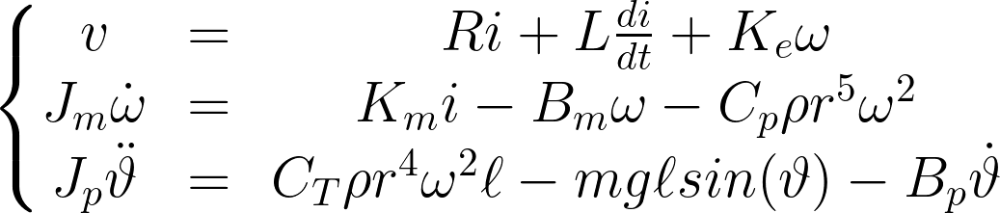
</p>

In cui le prime due equazioni riassumono la dinamica di un motore in corrente continua con la presenza di una coppia di disturbo dovuta alla presenza dell'elica; l'ultima equazione invece, modella la dinamica del pendolo in cui la spinta fornita dall'elica è modellata in funzione della velocità di rotazione del motore. Se trasformato in una rappresentazione ingresso-stato-uscita, tale modello richiede la misura o la stima di 4 stati: corrente e velocità di rotazione del motore, posizione e velocità angolare del pendolo. 
E necessario inoltre poter misurare o poter identificare i parametri del motore (*R; L; Ke; Km; Bm; Jm*) e quelli dell'elica (*Cp; CT; ρ; r*) oltre che a quelli del pendolo (J*p; Bp; m; l;*).

L'alternativa sta nell'approssimare alcune relazioni e ottenere un modello semplificato. Chiaramente, questo porta ad una minore affidabilità del modello con un conseguente peggioramento in termini delle prestazioni dell'algoritmo di controllo. Il modello semplificato prevede la sostituzione delle dinamiche di motore ed elica, con una relazione statica di tipo lineare. Ciò permette di diminuire l'ordine del sistema e conseguentemente, il numero di variabili di stato che è necessario misurare o stimare. Il modello che si ottiene con tale approccio è 

<p align="center">
  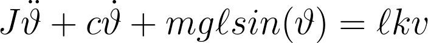
</p>


in cui gli unici parametri che non possono essere misurati direttamente sono il termine di attrito viscoso che modella il giunto, *c*, e la costante *k* che lega la tensione di alimentazione alla spinta generata dall'elica. 

L'analisi di vantaggi e svantaggi presentati dai due diversi approcci, fa ricadere la scelta sul secondo approccio che, se pur meno performante, risulta essere sicuramente realizzabile, anche in vista di particolari restrizioni temporali o economiche.

<p align="center">
  
</p>

### Realizzazione Fisica
Per quanto riguarda la realizzazione fisica della struttura dell'aeropendolo, è possibile analizzare separatamente le possibili scelte legate alle singole parti che lo
compongono: il motore, i sensori, il telaio ed il pendolo stesso.

Il telaio può essere realizzato utilizzando diversi materiali: componenti metalliche con conseguente difficoltà di lavorazione ma una migliore resa, oppure è possibile affidarsi a costruzioni tecniche presenti in commercio che presentano una facilità di assemblaggio ma una minore resistenza meccanica.

Per quanto riguarda il motore, vengono presi in considerazione due specifici modelli di motori in corrente continua e i relativi di sistemi di controllo della velocità; nonché il sistema di fissaggio dell'elica al rotore.

<p align="center">
  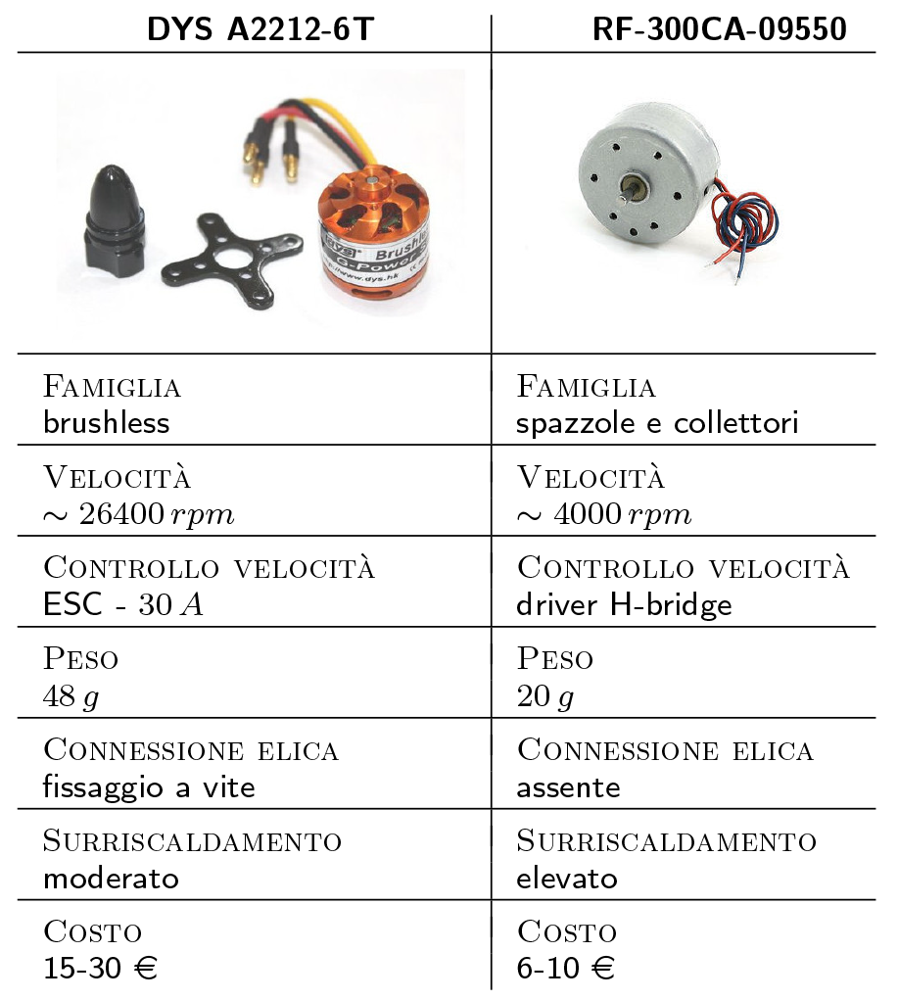
</p>

Riguardo i sensori, per la misura di alcune grandezze vengono valutate diverse alternative, che presentano caratteristiche diverse. In particolare si prendono in considerazione i sensori disponibili presso i fornitori locali o di cui si è già in possesso, con i quali comunque è possibile estrarre le informazioni necessarie all'identificazione e al processo di controllo del sistema.

<p align="center">
  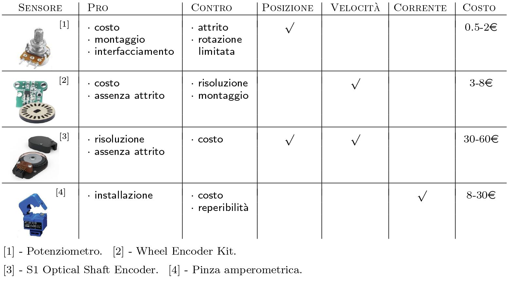
</p>

A seguito di questa analisi delle diverse possibilità si individua la configurazione migliore e si procede alla realizzazione fisica: il pendolo è composta da un'asta metallica ancorata ad un giunto rotoidale il quale, a sua volta, è collegato ad un potenziometro che fornisce la misura della posizione angolare del pendolo. 

All'estremità non vincolata è fissato un motore brushless *EMAX-CF2822* al quale è collegata un'elica *6040R*; il motore si interfaccia al microcontrollore per mezzo di un *ESC* (*Electronic Speed Controller*) da 30A. 

Il riferimento che si vuole far raggiungere al pendolo viene selezionato tramite un secondo potenziometro rotativo o tramite comunicazione seriale con un terminale di controllo remoto.

### Progettazione della legge di controllo
Prima di poter procedere all'implementazione di una legge di controllo *model-based* è importante conoscere i parametri il modello del sistema. Scelto un modello più semplificato per descrivere il sistema è necessario affrontare una prima fase di identificazione dei parametri dello stesso: *c*, il coefficiente di attrito viscoso presente nel giunto e la costante *k*, che modella il legame statico che vi è tra la tensione di alimentazione del motore e la spinta fornita dall'elica.

Le tecniche di identificazione classiche (come la stima ai minimi quadrati) prevedono la stima dei parametri di un sistema lineare. In questo caso invece, il modello scelto è non lineare, per questo motivo un possibile approccio alternativo potrebbe essere il seguente: stimare separatamente i due parametri a partire dall'analisi della risposta libera e di quella forzata del sistema.

#### Identificazione Coefficiente d'attrito

Ci si pone nel seguente scenario: punto di lavoro con angolo del pendolo pari a 0 radianti ed analisi della sola risposta libera del sistema. Nell'intorno di tale punto di lavoro è possibile effettuare l'approssimazione per cui il seno dell'angolo e circa pari all'angolo stesso ed il modello che si ottiene, scritto in termini di variabile complessa *s*, è il seguente:

<p align="center">
  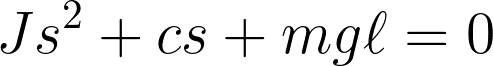
</p>

Il sistema ottenuto è lineare e del secondo ordine e può essere riscritto in termini di pulsazione naturale e smorzamento:

<p align="center">
  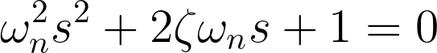
</p>

Comparando i due modelli, si evincono le seguente relazioni:

<p align="center">
  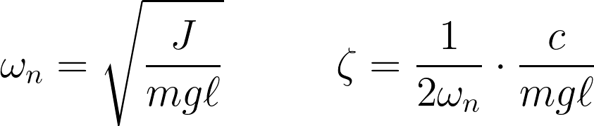
</p>

in cui è possibile notare come il valore della pulsazione naturale può essere ricavato considerando l'inerzia di un'asta rigida che ruota intorno ad uno dei suoi estremi, a cui viene sommata quella di un punto materiale (il motore con annessa elica) in rotazione. L'asta utilizzata ha un peso di 0,3 Kg ed una lunghezza di 0,6 m, il punto materiale ha una massa di 0,06 Kg e ruota intorno ad un asse distante 0,6 m; l'inerzia complessiva è dunque pari a 0,059 Kg m^2.


Il coefficiente di smorzamento può essere ricavato mediante la tecnica del *decremento logaritmico*: si perturba di poco la posizione del pendolo e lo si lascia evolvere in evoluzione libera; la risposta che si ottiene è oscillatoria e, a partire dal valore di due picchi successivi si calcola lo smorzamento come:

<p align="center">
  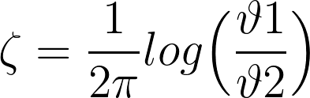
</p>

Effettuare l'esperimento sul sistema reale significa implementare un codice che legga le misure del sistema con una frequenza adeguata e le invii ad un software che le acquisisca, ad esempio *Matlab*. Mettendo in pratica l'esperimento con una perturbazione di circa 25 gradi, si ottengono i seguenti risultati:

<p align="center">
  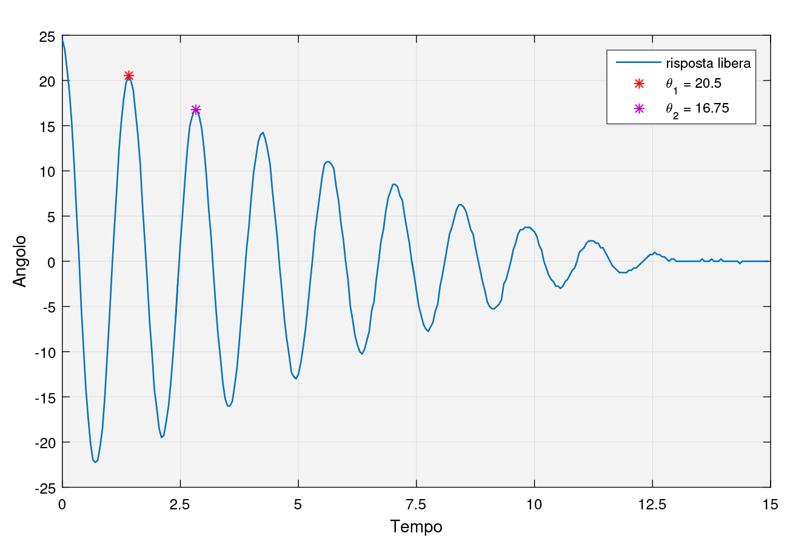
</p>

da cui si ricava il valore dello smorzamento e di conseguenza quello del coefficiente di attrito:

<p align="center">
  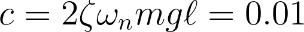
</p>

#### Identificazione costante spinta-tensione
L'identificazione della costante *k* che lega la tensione di alimentazione del motore alla spinta fornita dall'elica può essere effettuata a partire da diverse analisi della risposta forzata del sistema a transitorio esaurito. L'idea è quella di valutare il guadagno statico del sistema, stimando la retta che meglio approssima (nel senso dei minimi quadrati) i punti ottenuti come valori di regime raggiunti dall'angolo a fronte di diversi ingressi.

A regime, velocità e accelerazione del pendolo sono nulle, si ha quindi:

<p align="center">
  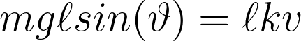
</p>

A partire dalle misure degli angoli, si calcolano i corrispettivi valori del seno e si calcola il valore di *k* a partire da una relazione inversa.

Tale esperimento si realizza facilmente implementando un software che generi diversi ingressi che spostino il sistema fino a portarlo in una condizione di regime, inviando quindi i dati di interesse. A seguito del procedimento, il valore di *k* che si ottiene è 0,685.

<p align="center">
  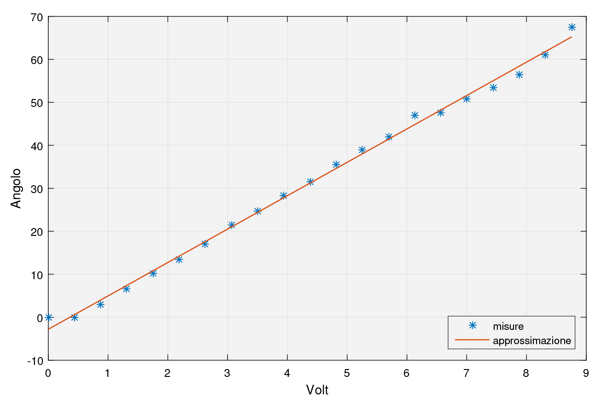
</p>

#### Legge di controllo
Per la legge di controllo, si sceglie di utilizzare un regolatore standard di tipo *proporzionale-integrale* (**PI**): tale tipo di regolatore permette di risolvere problemi di regolazione a zero e, grazie alla presenza dell'effetto integrale, il problema di asservimento di posizione. 

<p align="center">
  
</p>

La taratura dei parametri viene effettuata in *Matlab*, implementando e simulando il modello ottenuto a seguito dell'identificazione dei parametri. La taratura avviene cercando di ottenere una risposta del sistema che abbia sovraelongazione smorzata ed un tempo di assestamento prossimo a 10 secondi, accettabile per la natura del sistema. 

Ovviamente, è necessaria una seconda taratura empirica del controllore nella fase di test sul sistema fisico.

### Implementazione software su microcontrollore
L'implementazione di software sul microcontrollore avviene in realtà già nelle prime fasi dello sviluppo, per effettuare dei test di fattibilità con i materiali scelti e per validare il funzionamento dei singoli blocchi del sistema. 

L'intero software è composto, in definitiva, dai seguenti moduli:

<p align="center">
  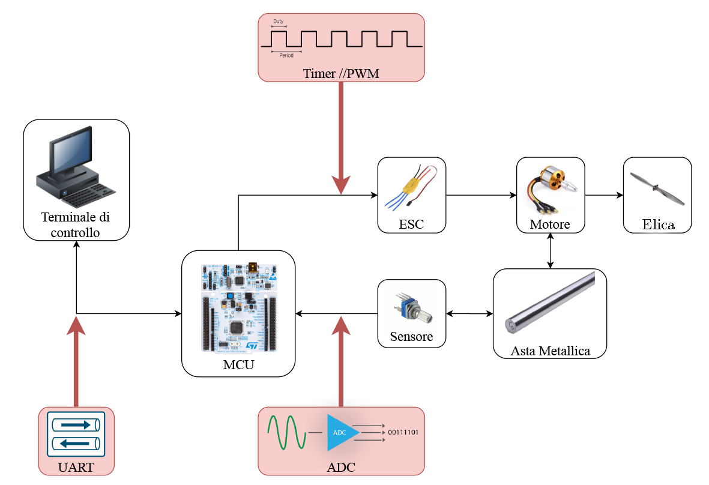
</p>

Questo schema a blocchi mostra tutti i componenti (interni ed esterni al microcontrollore) che intervengono nello sviluppo del progetto e devono essere gestiti.  

Per l'acquisizione dei dati si può utilizzare un **ADC** configurato, tramite **Timers**, in modo da acquisire i dati con una frequenza di almeno 20 Hz (sufficiente vista la dinamica del sistema). Le diverse letture, fatte a distanza di 50 ms, vengono conservate all'interno di un buffer circolare e, quando è necessario prelevare la misura, viene restituita la media di tali valori, eliminando la misura massima e la minima; tale artificio realizza un filtro digitale in grado di epurare il segnale da eventuali picchi spuri dovuti alla scarsa precisione del potenziometro.

Per quanto riguarda il motore, si utilizza un **Timer** per generare un segnale **PWM** a 50 Hz (con ampiezza tra 1 ms e 2 ms) che governi il motore brushless, tramite ESC.

L'azione di controllo invece agirà con un tempo di campionamento di 0,1 secondi, che, a seguito di test, risulta essere un tempo accettabile per ottenere i risultati desiderati. Il controllore utilizzato è un **PI** con *anti-windup* e questa azione viene eseguita tramite controllo logico: se il valore dell'ingresso di controllo raggiunge il valore di saturazione allora al termine integrale non viene sommato l'errore corrente ma viene sottratto.

Il **PID**, progettato in una libreria separata, implementa quindi una funzione di calcolo della legge di controllo come nello pseudo-codice seguente:

```c
PID_calculate(ref, measurement, &PID_struct){

  err = ref - measurement

  // Calcola termine integrale
  integral = update_integral(err)

  // Calcolo azione di controllo
  u_input =  (PID_struct->Kp * err) + (PID_struct->Ki * integral)

  // Anti-Windup
  u_input = anti_windup(u_input, err)

  // Aggiornamento errore
  PID_struct->err_old = err

  return u_input

}
```

in cui, la funzione `anti_windup` potrebbe avere una forma semplice come:

```c
anti_windup(u_input, err){

  if (u_input > u_max){
    u_input = u_max
    update_integral(-err) // Annullamento ultimo accumulo dell'integrale
  }else if (u_input < -u_max){
    u_input = -u_max
    update_integral(-err) // Annullamento ultimo accumulo dell'integrale
  }

}
```

Come per qualsiasi sistema di controllo embedded, il software deve occuparsi dell'interazione con diverse periferiche che operano con diverse temporizzazioni ed una strategia implementativa funzionale è sicuramente quella che fa uso del meccanismo delle interrupts, grazie alle quali è possibile acquisire misure o impostare delle *flags* per poter eseguire delle operazioni nel ciclo di vita principale. Le operazioni principali da eseguire sono: lettura dei valori dall'**ADC**, invio dei dati tramite **UART** ad un terminale di controllo ed applicazione dell'azione di controllo con intervalli di tempo fissati.

Una seconda strategia implementativa può invece fare uso di **RTOS**, strutturando l'applicazione in *task* e gestendo la loro sincronizzazione opportunamente.

In entrambi i casi, configurando opportunamente le periferiche e tarando i parametri del **PI** è possibile ottenere dei risultati come mostrato di seguito:

<p align="center">
  
</p>

Dopo aver raggiunto il punto di equilibrio, il controllore è in grado calcolare l'attuazione necessaria per il motore in modo da riuscire a riportare l'asta metallica nella configurazione desiderata, anche se con qualche oscillazione.

<p align="center">
  
</p>

Anche nel caso in cui la misura ottenga valori molto maggiori del riferimento, l'azione di controllo (faticando un po' di più) risce a determinare i valori necessari a far riportare l'asta nella posizione desiderata. 

Lo schema di controllo con il quale inquadrare l'intero progetto è il seguente:

<p align="center">
  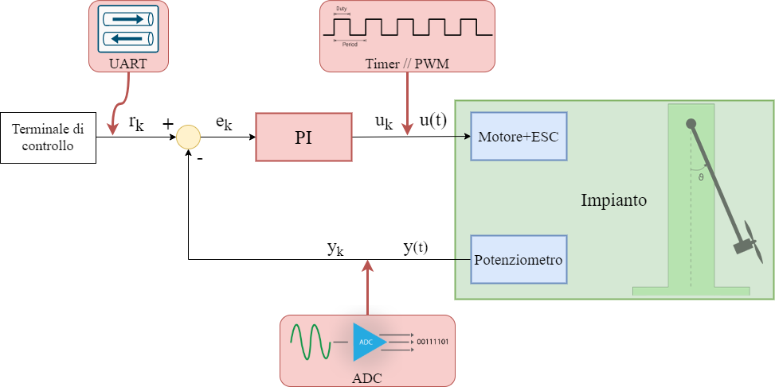
</p>

in cui si evince che, le diverse periferiche del microcontrollore fungono da interfacce tra *analogico* e *digitale*, permettendo la comunicazione tra l'algoritmo di controllo e l'impianto fisico.
