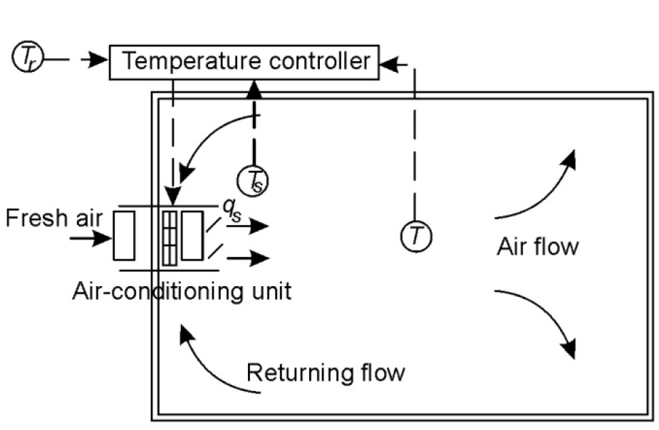
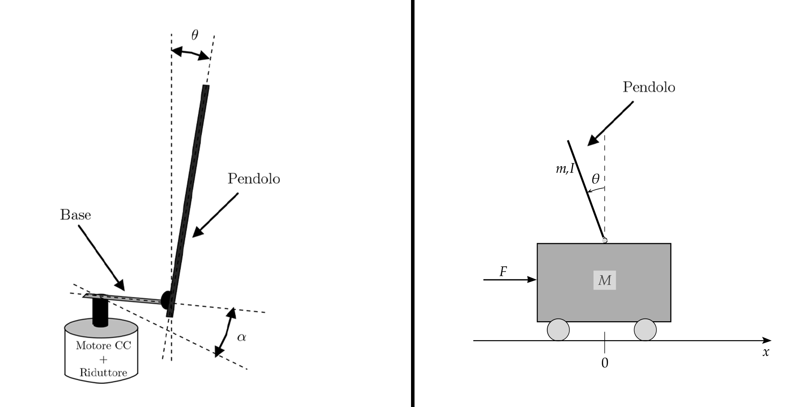
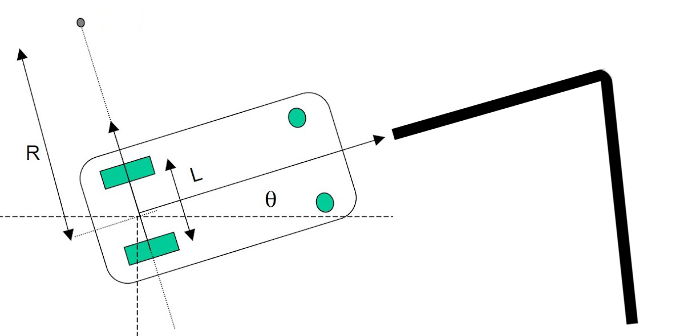
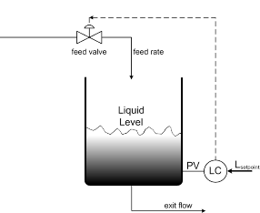
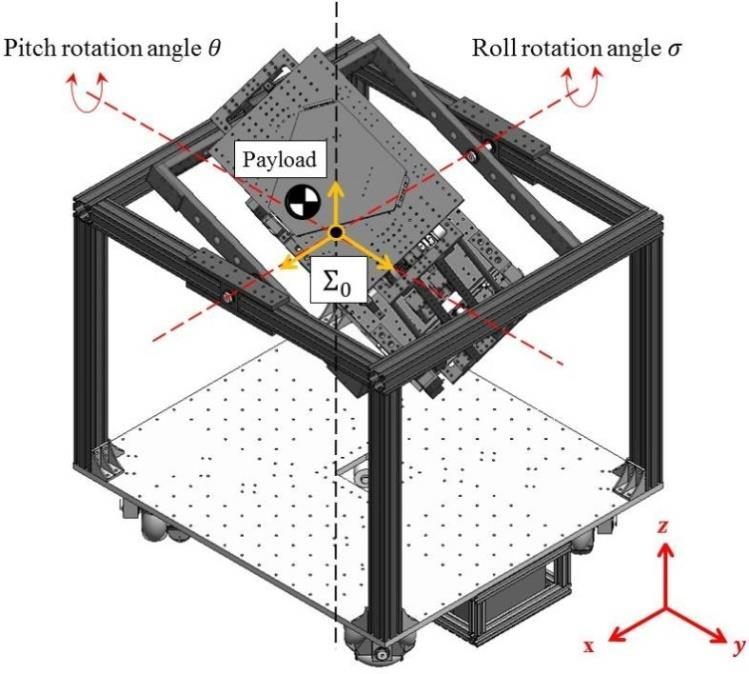
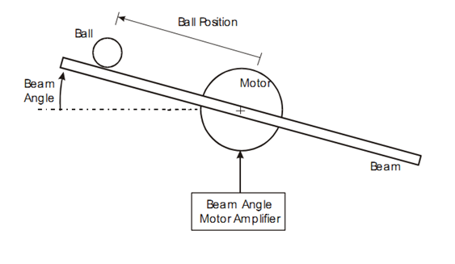
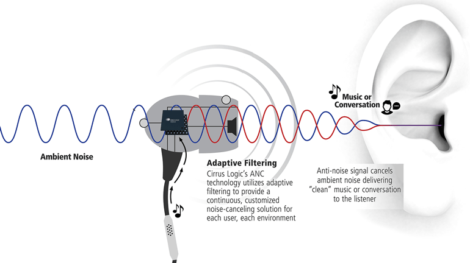

# SCE // Progetti Proposti

### Controllo di Temperatura
Sistema di controllo della temperatura in un piccolo ambiente chiuso: la misura della temperatura può essere determinata con diversi sensori, l'ambiente deve essere opportunamente riscaldato e raffreddato, controllando un motore connesso ad una ventola.

    

### Pendolo Inverso
Sistema di controllo che può essere realizzato in due forme: una che presenta un pendolo che deve essere tenuto in piedi da un motore posto su struttura fissa ed un secondo che deve essere tenuto in piedi dal movimento di un carrello, che ha la possibilità di muoversi lungo un asse.

    

### Line follower 
Robot mobile inseguitore di una linea, identificata tramite sensore a infrarossi: lo scopo del sistema di controllo è di gestire tramite regolatore il movimento delle ruote del robot per permettergli il movimento necessario a seguire una linea individuata tramite sensori ad infrarossi.

    

### Controllo livello acqua in serbatoio
Sistema di controllo di livello dell'acqua presente in un serbatoio: il serbatoio presenta un sistema di efflusso ed è riempito tramite una pompa, controllata, che preleva l'acqua da sorgente esterna. Scopo del controllo è di mantenere il livello dell'acqua entro valori desiderati anche a fronte di disturbi.

    

### Piattaforma stabilizzata
Sistema di controllo per il livellamento stabilizzato, lungo due assi, di una piattaforma: utilizzando un'unità di misura inerziale ed almeno due servomotori, lo scopo del sistema di controllo è quello di stabilizzare i movimenti di una piattaforma mobile.

    

### Ball and Beam
Sistema composto da una barra e da una sfera ([Ball and Beam](https://en.wikipedia.org/wiki/Ball_and_beam)), realizzabile in diversi modi, con diversi schemi di attuazione: lo scopo del sistema di controllo è quello di stabilizzare la sfera sulla barra grazie, alla misura della sua posizione tramite l'attuazione di un motore.

    

### Sistema di cancellazione attiva del rumore
Sistema embedded di controllo per elaborazione di segnali, che implementa un filtro che permette la cancellazione attiva del rumore di segnali acustici.

    

